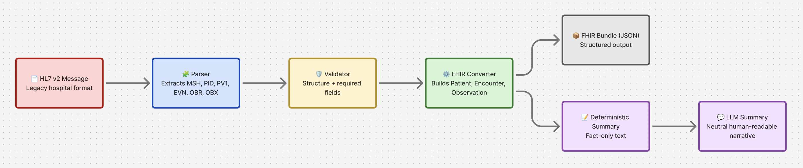

# Clinical Converter

Clinical Converter converts HL7 v2 messages (the legacy hospital messaging format) into modern FHIR JSON and produces simple summaries so the information is easy for humans to read.

### ▶️ Live Demo

https://clinical-converter-frontend.vercel.app/

The frontend is deployed on **Vercel**, connecting to the backend FastAPI service deployed on **Render**.

**Note**: The backend is hosted on Render’s free tier, so it may take 30–60 seconds to wake up on the first request.

## Why this project exists

A huge amount of healthcare data still moves through **HL7 v2**, a messaging standard from the 1980s. It works, but it’s messy: every vendor structures it differently, it’s hard to validate, and it doesn’t translate cleanly into modern systems.

At the same time, most new digital health tools, APIs, and analytics platforms speak **FHIR**—a structured, JSON-based standard built for interoperability.

If you want hospital data to flow into modern applications, you need a reliable way to get from HL7 → FHIR.

Most tools that do this are closed-source, heavy, or tied to enterprise HL7 engines. They hide their mappings and aren’t built for developers.

This project takes the opposite approach:  
a **small, clear, developer-friendly pipeline** that parses HL7, performs basic validation, converts it into a simple FHIR R4 Bundle, and optionally generates human-readable summaries. It’s meant to be easy to read, easy to extend, and useful for learning, prototyping, interoperability work, or demonstrating how clinical data pipelines actually function.

## What the tool does

<p align="center">
  
  <br>
  <em>HL7 → FHIR Processing Pipeline</em>
</p>

### 1. HL7 Parsing

The parser extracts the core pieces of information commonly found in
ADT (Admit, Discharge and Transfer) and basic lab messages:

- **PID** — patient demographics
- **PV1** — encounter details (location, attending doctor, class, etc.)
- **EVN** — event metadata (message type, timestamps)
- **NK1** — next-of-kin / related persons
- **AL1** — allergies
- **OBR** — order information
- **OBX** — observations (numeric or text)
- **MSH** — message header (used to detect message type)

The parser also handles typical HL7 formatting issues:
mixed line endings, stray blank lines, BOM characters, and other small quirks.

Segments that aren’t supported are simply ignored without breaking the parse.

---

### 2. HL7 Validation

The validation module performs a set of simple checks:

- Ensures required segments (MSH, PID) are present
- For ADT messages, ensures PV1 is present and EVN is recommended
- Checks basic ordering (e.g., OBX must follow OBR)
- Performs basic field checks (e.g., MRN present, OBX value present)
- Checks timestamp formatting in PV1 and EVN

This isn’t intended to be full HL7 conformance, just a set of practical
checks to help catch malformed files.

---

### 3. HL7 → FHIR Conversion

The converter builds a FHIR R4 Bundle containing:

#### **Patient**

- MRN
- Name
- Birth date
- Gender

#### **Encounter**

- Encounter class
- Event type
- Location
- Attending clinician
- Start/end timestamps
- Linked to the Patient

#### **Observations (OBX)**

Each OBX becomes an Observation with:

- Code + display
- Text or numeric value
- Units
- Reference ranges
- Abnormal flags
- Linked to Patient and Encounter

#### **Related Persons (NK1)**

Mapped to **FHIR RelatedPerson**, including:

- Name
- Relationship (e.g., SPO, MTH)
- Contact details

#### **Allergies (AL1)**

Mapped to **FHIR AllergyIntolerance**, including:

- Substance
- Reaction
- Severity (expanded: Mild, Moderate, Severe)

The output Bundle is simple and easy to inspect.

---

### 4. Deterministic Summary

The tool can produce a plain-text summary built directly from the FHIR Bundle.
It includes:

- Patient information
- Encounter information
- Observations
- Related persons
- Allergies

This summary contains only the facts that appear in the message.  
It avoids interpretation and avoids adding anything new.

---

### 5. Optional LLM Summary

For users who want a more readable version, the tool can produce a short
narrative summary using GPT-4.1-nano.

The model is restricted to the information in the deterministic summary,
and avoids clinical interpretation or recommendations.

---

### 6. HL7 Generator

The CLI can also generate synthetic HL7 messages (A01, A03, A04, or random)
for testing or demonstration.

---

## Command-line usage

Convert HL7 to FHIR

```bash
hl7-to-fhir -i file.hl7
```

Pretty-print the FHIR JSON

```bash
hl7-to-fhir -i file.hl7 --pretty
```

Validate HL7

```bash
hl7-to-fhir -i file.hl7 --validate
```

Deterministic summary

```bash
hl7-to-fhir -i file.hl7 --summary-deterministic
```

LLM summary

```bash
hl7-to-fhir -i file.hl7 --summary-llm
```

Generate synthetic HL7

```bash
hl7-to-fhir --generate-hl7 adt_random -n 5
```

---

## Tests

The project includes pytest tests covering:

- PV1 and EVN parsing
- Encounter creation
- Observation linking
- Parsing of real sample messages
- Summary generation

All tests currently pass.

---

## About the project

This project is a clean, approachable example of working with HL7 and FHIR.
It shows the full path from raw HL7 text → structured FHIR → human-readable summary, without relying on heavy libraries or opaque tools. It's designed to be extended and understood, not just used.
